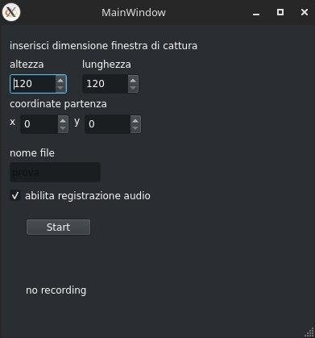

# Screen-Capture

## About Project

Project for the **PDS** course at the **"Politecnico di Torino"**

The **Screen-Capture** is based on two components.

- A multiplatform **C++** library which allow to record the screen and optionally capture the audio by the microphone.
- A **C++** frontend **QT Application**, used to interact with the **Screen-Capture library**.

### Team Members

- [Francesco Ciarla](https://github.com/kecco98)
- [Roberto Dimatteo](https://github.com/qwertyroby)

### Screen Capture Library

The library is composed by 2 main files **ScreenCapture.ccp** and **ScreenCapture.h**,
it uses **ffmpeg** libraries (**avcodec**, **avdevice**, **avfilter**, **avformat** and **avutil**) to capture video and audio frames and to put them in a **.mp4** file.

The library is multithread, and it uses **2 threads**, one for the **video** recording and one for the **audio** recording

- **CaptureVideo_thread**: It gets the raw video frames from the **os** virtual device (**x11grab** on Linux and  **avFoundation** on macOS) in order to **elaborate (decode and encode)** and **written** them in the output file.
- **CaptureAudio_thread**: It gets the raw audio frames from the **os** virtual device (**alsa** on Linux and  **avFoundation** on macOS) sin order to **elaborate (decode and encode)** and **written** them in the output file.

It offers the following features:

- **Pause** and **resume** recording without creating separated files.
- Allows the user to specify the **starting point**, the **width** and the **height** of the portion of screen that have to be recorded.
- Allows the user to specify the **output file name** (files are stored in the **media_output** folder)
- Record **screen video** with or without **microphone audio**
- In case of **errors** throws an **exception** with a **description of the error** and **stop the registration** in a good way, creating the output file using what has been recorded till that moment.

### QT Application

Allow to use the **ScreenCapture library**, offering a **GUI** to set the **parameters** and to give **commands**.

#### Screenshots

### Running Library
**ScreenCapture library** can be used also without the GUI,
in the "legacy" version is possible to record a video using the terminal window.

The user is asked to insert all the parameters and then can control the actions using:
- [p] to pause
- [r] to resume
- [t] to terminate

---

## Linux

#### QT application

- Download **Qt** (for developing was used QT 6).
- Open with **Qt Creator** the file `screen_capture_qt.pro`.
- Let Qt choose the best kit configuration. The default version provided should work just fine.
- Once the project is open, run the application using the green play button. You will see the GUI pop up.
- The application saves the output file in the ../ folder.

#### Legacy application

- Download the required libraries and tools `sudo apt install libavcodec-dev libavdevice-dev libavfilter-dev libavformat-dev libavutil-dev`.
- You must have a **c++ compiler** installed on your system.
- Clone the repository.
- Compile and run it (It was developed using CLion).
- The library saves the output file in the media_output folder (If it is not present please create it inside the project folder)

---

## Mac OS

#### Legacy application

- Clone or Download the repository in a folder.
- Install the required libraries with Homebrew packet manager `brew install ffmpeg`.
- Now you can compile and run it.
- The library saves the output file in the media_output folder (if it is not present please create it inside the project folder)